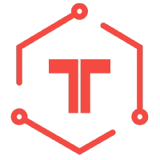
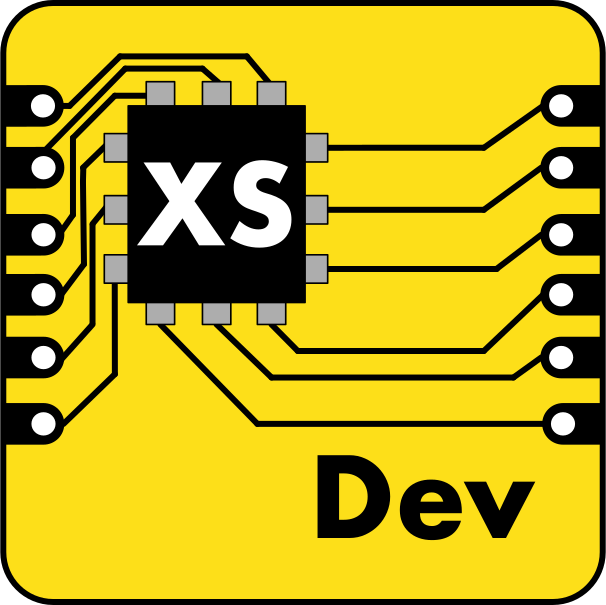

# Practicing Staff+ Principles in Open Source

<!-- 
Lessons learned from OSS maintainers that helped me become a staff engineer
-->

---

# Quick Facts

* Nick Hehr (@hipsterbrown)
* Senior Developer Advocate @ Viam
* Indoor climber / outdoor cyclist
* Home automation & embedded JS

<!--
As I was introduced, I'm Nick Hehr.
You can find me in most places online @hipsterbrown
I'm a senior dev advocate at Viam, where I help people learn to build robots and automate the physical world.
In my limited free time:
I enjoy climubing indoors and long bike rides outdoors.
I also like to tinker on my home and control hardware with JavaScript.
-->

---

# Quick Facts

- Nick Hehr (@hipsterbrown)
- Senior Developer Advocate @ Viam
- Indoor climber / outdoor cyclist
- Home automation & embedded JS

<!--
As I was introduced, I'm Nick Hehr.
You can find me in most places online @hipsterbrown
I'm a senior dev advocate at Viam, where I help people learn to build robots and automate the physical world.
In my limited free time:
I enjoy climubing indoors and long bike rides outdoors.
I also like to tinker on my home and control hardware with JavaScript.
-->

---

# <!--fit--> I :heart: Open Source

<!--
Last, but not least, I love open source. 

My perspective on collaborative software development has always been skewed by how I learned to build software in the first place;
online and through the openness of shared knowledge.
-->

---

<!--

Having worked on a variety of open source software and hardware projects, I will refer to them collectively as open source projects rather than OSS or OSHW.
I'm also not a purist about the term, so I recognize that some of the projects I reference may not fit the strict definition of open source software.

I would not be where I am today without open source communities and the amazing people that made them the supportive environments in which I was able to grow and learn.
So I want to thank those folks from Hoodie, Tessel, Johnny-Five, and Node Serialport for all they've done. Some of the projects may no longer be active, but they're not forgotten.
-->

---

## Contributing & maintaining open source projects   taught me to be a staff engineer

<!--
It wasn't until I was promoted to the role of staff engineer at Betterment, that I realized the recognized attributes and skills I practiced were instinctively modeled after my mentors and friends from the open source projects I worked on previously.
-->

---

# Learn & adapt open source practices in your role

<!--
This is my attempt to organize the key elements from participating, contributing, and maintaining open source projects that are sought after skills for staff+ individuals;
as well as how to put them into practice inside your teams and organizations.
-->

---

# Three Tenets of Staff+ Open Source

1) Influence without Authority
2) Scaling Yourself
3) Being Glue

<!--
I've identified three tenets of staff+ principles I've observed in practice by open source maintainers. 

It is my hope that you'll come away from this presentation with new approaches to how you operate as a staff+ leader
and maybe a bit inspired to start contributing to your favorite open source projects.
-->

---

<!-- header: Influence without Authority -->

# Influence without Authority

<!--
[Drink some water. Breathe.]

This is probably a familiar phrase that folks have seen in the company career matrix or heard from their manager when discussing what the're looking for in staff+ roles.
-->

---

## Influence the technical direction of a project  without holding authority over team

<!--
Compared to the management track, senior ICs are sought after for technical influence over the direction of the project (or organization) without holding authority over team members (i.e. ability to promote, reprimand, or fire)
-->

---

### Maintainers are held to a high standard but they do not manage contributors

<!--
If you've ever participated in an open source project, this tenet should be relatable.
Most of them are made up of volunteers are motivated but don't report to any other individual.
-->

---

## Strong, meaningful communication matters

<!--
Both staff+ roles and open source maintainers require strong communication skills to convince and motivate the team (or entire organization for large initiatives) to follow ideas they believe should be implemented.

These can be quick decisions, like choosing a certain library for a feature (or not), or long term bets, like selecting a language or framework as a standard for a product as a whole.

So how do you go about accomplishing this task?
-->

---

## Open & Shared Context

<!--
First of all, it's tough to execute on a plan without a shared understanding of why and how you made it.
How well can you as a technical leader explain your thinking (or even the collective idea of a group) to other team members who have infrequent familiarity with the project as a whole?

This is like trying to cook a meal in a room full of other chefs by going off a menu in your mind.
Some of them might get it by watching you for a little bit but other might start making something completely different. it's certainly a lot quicker and more efficient when you've had even a brief discussion up front.
-->

---

## Artifacts for Communication

* Design Documents
* Architecture Decision Records (ADR)
* Request for Comments (RFC)

<!--
Being able to point to artifacts for plans and decisions, like RFCs and ADRs, go a long way towards this goal.
-->

---

> One way of thinking about software is as a collection of decisions made at a certain point in time.
> \- Juan Pablo Buriticá

https://github.com/readme/guides/making-decisions-in-OSS

<!--
When questions come up around why certain standards are in place or what led to using one technology over another, these documents can be great asynchronous references for new team members or contributors.

These decisions can still evolve and change over time due to new circumstances or requirements for a project, which is why it's just as helpful to document why you may not have chosen a certain path that was explored.

For example, if your team is choosing a front-end framework, which ones did you explore and how was the final selection made?

The larger the initiative and wider the scope, the more communication is required to get everyone moving in the same direction.
-->

---

## RFCs

* Internet Engineering Task Force (IETF) - https://www.ietf.org/process/rfcs/
* Rust - https://github.com/rust-lang/rfcs
* Swift Evolution https://www.swift.org/swift-evolution/
* Python Enhancement Proposals https://peps.python.org/
* Gov.UK https://github.com/alphagov/govuk-rfcs
* Hoodie Discussions https://github.com/hoodiehq/discussion

<!--
The IETF has one of the longest public records of RFCs to establish the standards of a medium that connects us all. 

Programming language groups, like Rust, Swift, and Python, are great references for documenting the various concerns of wide reaching projects. As I've explored the Python ecosystem even more in recent months for work, it's incredible to see libraries and tools point to PEPs as a reference to the spec to which they are conforming.

Gov.UK has always been one of my favorite examples of how an organization can work in the open. They document their decision making in RFcs, and have a robust design system to cover the needs of their platform.

It doesn't have to be super formal up front. It's more about the motion of opening up a topic for folks who are impacted and/or have additional knowledge about the impact of the change to provide feedback that shape the design.
With the Hoodie project, we started out with a general discussions repo (before official Discussions feature were ever considered) to coordinate shared topics across repos.
-->

---

## ADRs

* Home Assistant - https://github.com/home-assistant/architecture
* TestTrack - https://github.com/betterment/test_track
* GitHub - https://adr.github.io
    - Actions Runner
    - Primer Design System

<!--
While I've seen them adopted more by private organizations, there's a good number of examples of ADRs in the open source ecosystem as well.

The Home Assistant project, which has been around for nearly 11 years and one of the most active projects on GitHub, has an enormous task of providing an open platform for smart home devices and integrations. They have 5 years of ADRs that cover minimum python versions to code formatting to how they plan to deprecate legacy features without breaking their ecosystem.

At Betterment, they adopted ADRs both internally and in open source projects maintained by the company. These were used alongside RFCs and Design Docs within the organizaiton, depending on the initiative and audience.

Another company that has openly committed to ADRs is GitHub, demonstrating it through their projects like the GitHub Actions Runner and Primer Design System.
-->

---

## Resources

- Architectural Decision Records - https://adr.github.io
- Why Write ADRS - https://github.blog/engineering/architecture-optimization/why-write-adrs/
- Understanding Legacy Code - https://understandlegacycode.com/blog/earn-maintainers-esteem-with-adrs/
- Open Decision Framework - https://github.com/open-organization/open-decision-framework
- Design Doc templates - https://www.designdocs.dev/library

<!--
Here are a number of helpful resources for learning about adopting this open communication and historical format within your team or organization as a whole.

ADRs are a really great starting place because they're typically historical references. So consider what parts of your domain that are stuck as word-of-mouth knowledge and would be helpful for anyone to onboard or even when planning to change that decision later.
You don't have to be in a staff+ position to write an RFC, Design Doc, or ADR, but in those roles, you have the best context to provide influence over these artifacts.
--->

---

## Remember to connect with the human on the other side

<!--
However you plan to communicate your plans or previous decisions, whether internally or in the open, let's not forget the reason why we're doing it in the first place.
Through all the jargon and diagrams, be sure to address the audience, which could be future you, a new team member, or a complete stranger on the internet who has taken an interest in your project.
-->

---

<!-- header: Scaling Yourself -->

# Scaling Yourself

<!--
[Drink some water. Breathe.]

Yet another common idiom in the staff+ vocabulary. Who has heard this one before?
It is a reminder about the inefficientcies of attempting to doing every task solo while applying the same level of quality and care to the project.
-->

---

## What could you accomplish as a team of one?

<!-- 
Many times you might be tasked with leading a project or initiative that is deemed important but there's no official or dedicated team behind it.

About a year after I joined Betterment, I made the case for a frontend platform team to support the growing usage of frontend frameworks, the component libraries, and associated infrastructure to ship them across the various applications.
Much to my delight, that team was approved with a head count of one: me. This basically shifted what I was doing alongside my day-to-day work on a product team to my full-time job.
Now I had to figure out how to maintain all the projects I was responsible for, while proving it was worthwhile to keep investing in the team.
So I put on my open source maintainer thinking cap to consider how I observed this being done by others.
-->

---

## Where is the bottleneck?

<!--
First off was investigating where most people were losing time or getting stuck in any of these projects. This would help provide a set of priorities as it was key to get some quick wins before making any larger, longer-term bets.

This was done mostly through looking at PR comments and questions asked in Slack channels to find the common issues.
--->

---

## ~~Where~~ Who is the bottleneck?

<!--
It might not be surprising to find that, one of the things I discovered was that one of the core areas of friction was...
--->

---

## Who is the bottleneck?

### Hi. It's me.

<!--
...me. More specifically, it was the manual processes that relied on a maintainer or another person with authorizaiton to complete.

For example, if someone contributed a new component or a change to the design system, they had to wait for someone to run the existing release script in their local development environments to publish a new version to the appropriate places.
I did my best to keep this waiting time as minimal as possible, but I can only be on top of so many things, and that put a lot of pressure on me when I wasn't available.

(Next)
--->

---

## Automate the tedious tasks, so you can spend more time on the human ones

<!--
So putting some time into automating this process freed up more of it for me to work with teams and individuals more personally. 

This was something I learned from Gregor Martynus on the Hoodie project. He is now a Staff Engineer at GitHub and a life long friend.

What are some other tasks you can think of that rely solely on you or an unreasonably small group of individuals? Could they be automated completely and reliably, or distributed more widely?
--->

---

## Enable more people to help through tooling

https://github.com/noopkat/avrgirl-arduino/blob/master/CONTRIBUTING.md#manual-testing

<!--
Other examples of investing in solutions to accomplish more with your time. 

Suz Hinton (noopkat) created avrgirl test-pilot to help with the friction of manual testing. With hardware, there are so many devices that it would be impractical for an individual maintainer to test them all.
This tool was a CLI command away; making it as smooth as possible for people in the community to share test reports and be recognized for their contribution. 
--->

---

## Enable more people to help through tooling

https://github.com/tessel/t2-crash-reporter

<!--
The Tessel project integrated a custom crash reporter to automate creating issues with stack traces. It stripped identifying information (like usernames in HOME paths) while informing users how to follow up with the created issue.

This kind of tooling embedded in the projects can help with that task of identifying common issues and put data behind your planning without compromising on the privacy of the people that use it.

Automation is fun (in my opinion), but scaling yourself is more than just off-loading tasks...
--->

---

## Grow the next generation

<!--
It's about enabling the next generation of maintainers and staff+ leaders.
--->
---

### Set the path from "good first issue" to core maintainer

<!--
New maintainers don't just pop out of the ground, ready to lead a project. Some can grow in the harshest of climates
but many can thrive when nurturrd and supported with guidance and mentorship. This is often overlooked by maintainers who want keep their heads down to the focus on the deep technical problems.
--->

---

### You are the best equipped to distribute work to those looking to help

<!--
But it is exactly that deep technical knowledge that makes them the best person to distribute work to multiple others who want to get involved with the project.

This was something else I appreciated about the Hoodie project as I experienced this journey from end-to-end:
- I started out contributing tutorials and API documentation
- Finding good first issues, I started contributing code
- Over time and as my understanding of the project grew, I start helping plan features
- Eventually, I was offered a role as a maintainer.

What are those "gateway tickets" for the new person joining your team? Or a senior engineer looking to make a bigger impact?
More than just creating issues or tickets, does the content of the task include enough context to allow anyone to pick them without your intervention?
This can be a real test of how much you understand a problem when you need to essentially draw a map to the solution without digging up the treasure for yourself.

It can be hard to let go of being the person to implement the big features, seeing your name in the major release.
--->

---

> Working on open source helped me overcome this. If you don’t get yourself out of the main flow, the project will never exceed your own capabilities and that’s a very limiting situation.
> \- Jan Lehnardt (CouchDB, Hoodie, Greenkeeper, Neighborhoodies)

<!--
I appreciate what Jan shared with me on this topic.
How can we hope to grow and improve if we don't get out of our own way to let fresh eyes and ideas to explore with open support?
--->

---

## Pull Request Fan Out

https://github.com/home-assistant/core/blob/dev/.github/PULL_REQUEST_TEMPLATE.md

<!--
Home Assistant has an interesting approach to scale out the task of code review to get a handle on the growing backlog of PRs. 

First, let's appreciate the lovely checklist of items to set the bar of what's expected by a pull request for this project.

Finally, it prompts potential contributors to review two other open PRs as an incentive to boost the chance of getting your's reviewed.
They even provide a handy link to a filtered view of open PRs that have passed CI and waiting for review (not in a draft). 

Would you feel confident doing this?
--->

---

## How are you setting up your team for success without you?

<!--
Ultimately, scaling yourself comes down to how well are you setting up your team for success when you're not there.
As much as some would like to be indispensable, people get sick, take vacation, go on parental leave, or move on from the company. 
Projects without a succession plan may be doomed to wither and fall apart.
--->

---

<!-- header: Being Glue -->

# Being Glue

<!--
Which brings me to the final tenet.

[Drink some water. Breathe]
--->

---

Linux Foundation Research Survey

<!--
This whole time, I've been referring to maintainers without providing any sort of shared definition of the role.

I quite like the list of roles provided by the Linux Foundation in a recent survey. 

> A maintainer is a key individual (or group of individuals) responsible for the overall management and well-being of the open source project.
> They make critical decisions, merge contributions in the project, release new versions, and ensure the project's long-term viability.

Does that match your image and understanding of maintainers in your mind? 
--->

---

## Maintainers are the glue for open source

<!--
If you've heard of Tanya before, it might be from her fantastic book "The Staff Engineer's Path" or from her talk/blog post "Being Glue" about the concept of "glue work" that keeps a project together and a team successful, unrelated from code.

Reflecting on that definition we just read, did anyone see pushing code in there?
--->
---

### Glue work in open source

* triaging issues
* answering support requests
* reviewing PRs
* monitoring automations
* moderating discussions
* preparing releases
* maybe code

<!---
If you've ever watched any live streams of people maintaining open source projects, you might be familiar with what's involved.

They are typically responsible for these tasks because they have the most knowledge about how it all runs
and tend to toil away in the background to make sure it gets done.

Without this work, the projects start to topple over under the weight.
---->

---

https://xkcd.com/2347

<!---
When I see this XKCD now, I don't think of that little block as the open source project
but rather the maintainer as the tiny Atlas holding up this world we depend upon.
--->

---

## Maintainers are the glue for your product

<!---
This is where I get on my soapbox a bit.

Maintainers, both internally and externally, are the glue for the applications, services, and infrastructure you use to (hopefully) be successful as a company.

Does anyone here know who maintains each of the dependencies you rely upon?
--->

---

https://arstechnica.com/security/2024/03/backdoor-found-in-widely-used-linux-utility-breaks-encrypted-ssh-connections/

<!--
This is not meant to be a scare tactic, rather this is a story of some folks keeping one of those tiny blocks in the stack balanced
and accepting help in that endeavor.

Stories like this shouldn't have to keep coming up to build awareness if technical leaders inside companies can help keep these concerns top of mind.
--->

---

## Thank the maintainers in your life

<!--
As you continue to explore and create with open source, be mindful of the people behind it.

But even more importantly...
--->

---

## Pay the maintainers of your stack

- https://opencollective.com/
- https://github.com/sponsors
- https://tidelift.com/
- https://polar.sh/

<!--
I'm slightly biased, having worked at Open Collective,
but there are many options for learning about those projects you depend on that are seeking support.

As Staff+ leaders, you can influence the initiative to keep your stack funded and running smoothly.
--->

---

## Contribute to your stack

<!---
When funding them is not available or possible, consider how to give back through contributing your time and knowledge. 
This can also go a long way to distribute the burden on maintainers.
--->

---

<!-- header: Practicing Staff+ Principles in Open Source -->

# Three Tenets of Staff+ Open Source

1) Influence without Authority
2) Scaling Yourself
3) Being Glue

<!--
To review:

- communicate like a random person on the internet might stumble upon it
- find opportunity to be human and set a path for others to grow
- recognize yourself as a maintainer and the shoulders of other maintainers that we stand on
--->

---

# <!--fit--> Thank You
